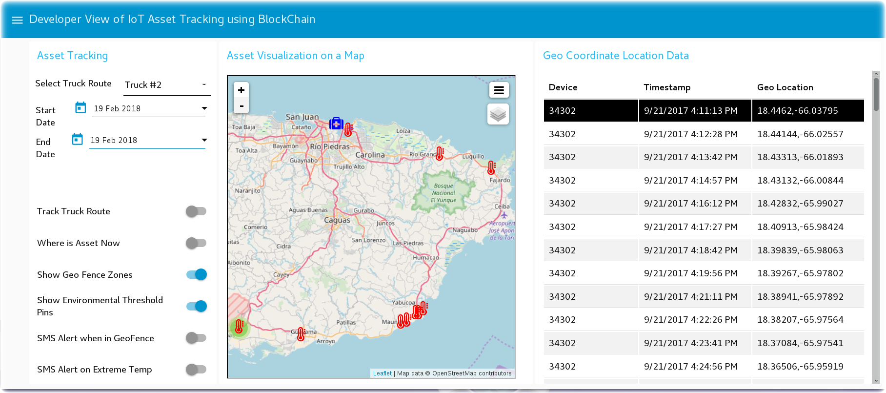
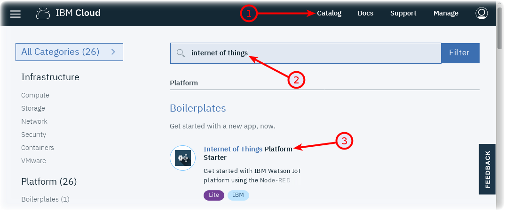
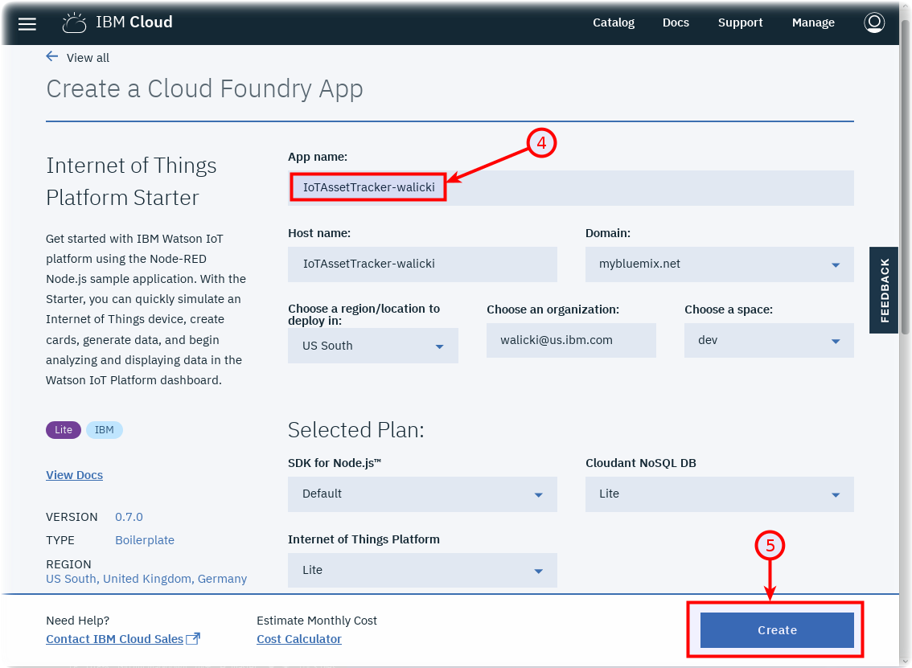
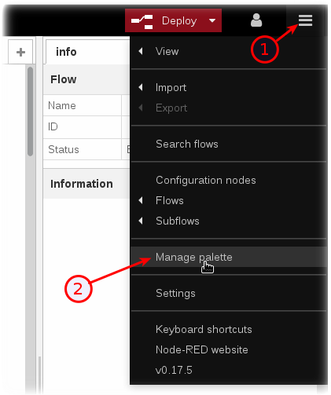
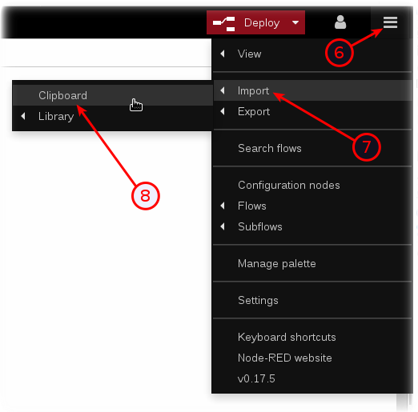
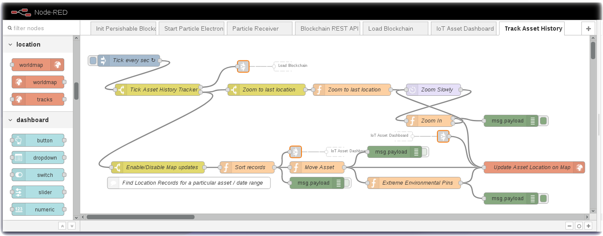

*Read this in other languages: [English](README.md).*

# Node-RED - IoT 資産トラッカー
## Node-RED - IoT 資産トラッカー 前書き

今回の Node-RED プログラムフローは、IoT資産トラッカーを実装し、Particle Electron からジオロケーションと環境センサーデータを受け取り、その情報を Hyperledger Fabric ブロックチェーンに格納し、マップ/ダッシュボード上の IoT デバイスのルートを視覚化します。
環境データが閾値を超えた場合に警告をトリガーします。

このワークショップでは、GitHub からフローをコピーし、IBM Cloud 上で動作する Watson IoT / Node-RED Starter アプリケーションにデプロイします。

7つのフローは、次の機能を実行します:

* **ブロックチェーンと Node-RED 変数を初期化** - すべてのフローを駆動するグローバル変数を設定します。
* **Particle Electron の制御** - Particle Electron を有効/無効にする Node-RED Dashboard。
* **Particle Electron イベントの受信** - Particle Electron イベントハンドラを購読する。
* Hyperledger Fabric ブロックチェーンへの **Particle Electron データの書き込み**
* **ブロックチェーンのトランザクション履歴をロード** し、IoTデバイスのルートをプロットする。
* **Build a Dashboard を作成** し、デバイスの視覚化を制御する。
* **記録された履歴に沿って IoT アセットを移動** することで、地図上にルートを視覚化する。

ダッシュボードは、エンドユーザーにとって魅力的なユーザーエクスペリエンスではありません。これらのダッシュボードは、IoT 資産トラッカーで何か実装可能であるかを示すための、開発者向けのデモンストレーションです。エンドユーザーは、ジオロケーション座標には関心がないでしょう。

## IBM Cloud 上で Node-RED を使い始める

IoT 資産トラッカーのダッシュボードを導入する前に、IBM Cloud 上で IoT Starter アプリケーションを作成する必要があります。このセクションでは、これらの手順について説明します。

### Internet of Things Starter アプリの作成

* [IBM Cloud](http://bluemix.net) のアカウントを作成しログインする。
* **(1)** のカタログをクリックし、 **(2)** 'internet of things' を検索する。
* Internet of Things Platform Starter **(3)** ボイラープレートは、あらかじめ組み立てられたサービスが一緒に働くパターンです。 Internet of Things Platform Starter には、Node-RED Node.js Webサーバー、フローを格納する Cloudant データベース、IoT プラットフォームサービスが含まれているため、デバイスを接続できます。

* アプリケーションに何かユニークな名前を決めましょう。もし *myapp* という名前をつけたのなら、あなたのアプリケーションは http://myapp.mybluemix.net のURLアドレスに配置されるでしょう。*myapp* アプリケーションとそのURLは、IBM Cloud 内で1つしか登録できません。
* 決めたユニークなアプリケーション名を **(4)** に入力します - 例えば *IoTAssetTracker-yourname* のように。
* **(5)** Create ボタンをクリック。

* IBM Cloud は、ボイラープレート内で定義されたサービスに基づいてアカウント内にアプリケーションを作成します。これはアプリケーションのステージングと呼ばれます。このプロセスが完了するまでに数分かかることがあります。待っている間は、`Logs` タブをクリックして、プラットフォームと Node.js ランタイムからのアクティビティログを見ることができます。

### IoT Starter アプリケーションの起動

緑の `Running` アイコン**(6)** が表示されたら、`Visit App URL` リンクをクリックします

### Node-RED ビジュアル プログラミング エディタを開く

新しいブラウザタブが開き、Node-RED の開始ページが表示されます。
Node-RED は、オープンソースの Node.js アプリケーションで、ビジュアルプログラミングエディタを備えており、フローを簡単に配線できます。
Node-REDエディタにアクセスするには、ユーザ名とパスワードを選択します。
あなたのユーザー名とパスワードを忘れないでください。
赤いボタンをクリックします。
Node-RED フローエディタを選び、エディタを起動します。

* Node-RED Visual Programming Editorがデフォルトのフローで開きます。
* 左側には、フローにドラッグできるノードのパレットがあります。
* ノードを結んでプログラムを作成することができます。
* サンプル IoT スターターフローはこのワークショップでは使用しませんので、削除してかまいません。
* 上で説明したフローをこれからインポートします。

### 追加の Node-RED ノードをインストールする

IBM Cloud に導入された IoT スターター・アプリケーションには、Node-RED ノードのわずかなサブセットしか含まれていません。Node-RED パレットは、さまざまなデバイスや機能に合わせて1000個以上のノードを追加することで拡張できます。これらのNPMノードは http://flows.nodered.org で閲覧できます

このステップでは、Node-RED Dashboard ノードを Internet of Things Starter アプリケーションに追加します。

* 右上のNode-RED Menu **(1)** をクリックし、Manage palette **(2)** をクリックします。

* Install tab **(3)** を選択し、"node-red-dashboard" **(4)** と入力し、Install **(5)** ボタンをクリック。

* 次に表示されたダイアログでも Install ボタンをクリック。
* 同様に **node-red-contrib-particle** と **node-red-contrib-web-worldmap** もインストールする。

### GitHub から事前に作成されたフローをインポートする

Node-RED ノードを設定してそれらをまとめて配線するためには、スクリーンショットで文書化するための多くのステップが必要です。事前に作成されたフローを IoT スターターアプリケーションにインポートすることで、フローを簡単に作成できます。

* 以降のセクションのいくつかには **コードを取得** のリンクがあります。

* 指示があったら、**コードを取得** する GitHub URLを開き、マークを付けるか Ctrl-A を押してすべてのテキストを選択し、フローのテキストをクリップボードにコピーします。

* Node-RED Menu **(6)** をクリックし、Import **(7)** をクリックし、Clipboard **(8)** をクリック。

* フローのテキストを **Import nodes** ダイアログにペーストし、赤い **Import** ボタンをクリック。

* 新しいフローは、Node-RED Editor の **新しいタブ** にインポートされます。

## 生鮮品のブロックチェーンと Node-RED フローを初期化する

### 前書き

このフローは、他のすべてのフローを駆動するいくつかのグローバル変数を設定します。 Hyperledger Fabric IP アドレス、Particle Electron デバイスID、アクセストークンなどを変更するために他のフローを検索する代わりに、このフローではグローバル値として事前にプルしておき、残りのフローでは単にそれを利用します。

* 自身の [Hyperledger Fabric](../Blockchain/README.md) を設定している場合は、**Set HyperLedgerFabricIP** Changeノードを編集し、パブリックIPアドレスを挿入します。
* Particle Electron を購入した場合は、Particle デバイスIDとアクセストークンを知り、その詳細を **Particle Electron to Monitor** Changeノードに挿入する必要があります。
* あなたがワークショップに参加している場合、インストラクターは Particle デバイスIDとアクセストークンを別のスライド (GitHubには含まれません) で共有します。

初期化フローでは、デモとワークショップを実行するために、以下で説明するほとんどすべてのフローに対してリンクノードを使用します。

最初のステップとして、コードを GitHub からクリップボードにコピーし、Node-RED エディタにインポートしてみましょう。

**コードを取得** [IoT Asset Tracker Node-RED flows](flows/IoTAssetTracker-AllFlows.json)

## Particle Electron イベントの制御

### 前書き

このフローは、Particle Electron デバイスの構成を制御します。
このフローは、デバイスの地理ロケーションレポートを有効または無効にするコマンドを送信できます。
レポートの間隔を変更することができ、デフォルトは60秒です。
また、Particle の2つの照会機能、GetRecentXYZ() と GetCurrTemp()も実行します。
加速度のしきい値は、SetXYZThresh() の呼び出しによってリモートで設定することもできます。

Particle.io URL関数呼び出しは、アクセストークンを使用して特定のデバイスを制御します。
最初のタブの InitPerishableBlockchain フローにアクセストークンが設定されています。
講師はワークショップの後にこのアクセストークンをリセットします。

このダッシュボードのインスピレーションは Hovig Ohannessian のものでした。
彼は、[Particle Core Bluemix article](https://www.ibm.com/blogs/bluemix/2015/05/led-hello-world-with-spark-core-android-bluemix/) を書きました。
これはパラメーターを設定し、**httpリクエストノード** を使用して Particle 関数コマンドをポストするものです。

私は Node-RED Particle Function ノードも試しましたが、このユースケースでは柔軟性がありませんでした。
フロー がParticle デバイスIDまたはアクセストークンを動的に設定できませんでした。
ドロップダウンから選択可能な複数の Particle デバイスがある場合、Node-RED Particle Function ノードは特定のデバイスにハードコードされます。
IoT 資産トラッカーのプロトタイプ作成には Particle Electron が1個しかないかもしれませんが、デプロイを開始するときには数十〜数百個になる可能性があります。
本番用のデプロイでは MQTT に切り替えることをお勧めします。

## Particle Electron イベントの受信

### 前書き

Particle Receiver フローでは、**node-red-contrib-particle** ノードを使用します。ParticleSSE ノードを使用すると、永続的な接続を介して Particle クラウド上の着信サーバー受信イベント (SSE: Server-Sent Events) を購読できます。

このフローには 4つの ParticleSSE() ノードがあります。
それぞれは、InitPerishableBlockchain フローによって設定されたデバイスIDとアクセストークンを必要としています。

* 最初の ParticleSSE() ノードは、Google Maps ジオロケーションイベントが有効になっていることを確認し、 Particular Electron の deviceLocator イベントにサブスクライブします。フローはこの情報で何もしません。これは単なる健全性のチェックです。

* 一番下の ParticleSSE()ノードは、ジオロケーションイベント メッセージを解析して試します。 フローはこの情報で何もしません。

* 間にある ParticlesSSE() ノードは、Particle Electron の AssetTrackerAccelerationEvent関数 と AssetTrackerTemperatureEvent 関数を購読しています - これらに関しては [WatsonIoTAssetTracker program のドキュメント](../ParticleElectron/README-ja.md) を見直してください。
この情報は文字列から JSON オブジェクトに変換され、解析され、ブロックチェーン イベントに必要な msg.payload に再フォーマットされます。デバイスの GPS 座標が移動していない場合は、Exception ノードによる報告でイベントが破棄されます。この決定は単に、私が動作している装置のみの環境センサーの状態を気にしていたからです (そして、席に座って作業している間、テスト目的には、全てを扱うとデータ量が多すぎたので)。 実際の実装では、デバイスが流通センターの駐車場またはポートに置かれている間に温度と加速度のイベントが気になることがあります。 多くの場合、AssetTrackerAccelerationEvent 関数と AssetTrackerTemperatureEvent 関数は、deviceLocator コールバックによってほぼ同時にトリガーされます。 フローは、ブロックチェインがずらして少しずつ書き込むことで、Hyperledger Fabric に (書き込み障害を引き起こす可能性があるような) 大きな負荷をかけることが防ぎます。

まとめると、このフローは到着するデータを取り込み、再フォーマットし、次のフローを呼び出して、Particle イベントを Hyperledger 生鮮品のネットワーク ブロックチェーンのトランザクション履歴に書き込みます。

## Particle イベントを Hyperledger 生鮮品のネットワーク ブロックチェーンに書き込む

### 前書き

このフローは、Hyperledger Perishable Network REST API を呼び出すための http パラメータを設定します。
このワークショップの [Blockchain README](../Blockchain/README-ja.md) セクションで Hyperledger 生鮮品のネットワークモデルについて学んでください。
このフローには6つの REST API の例があります。

* 最初の REST API が SetupDemo API を呼び出します。これは一度だけ呼び出す必要があります。ブロックチェーンモデル [chaincode logic.js](../Blockchain/IoT-Perishable-Network/logic.js) の中に埋め込まれている場合、出荷IDとして Particle デバイスIDを挿入する必要がある setupDemo() 関数があります。
* 2番目のセクションでは、トランザクションとして温度イベントをブロックチェーンに書き込むために必要な POST コマンドを設定します。
* 3番目のセクションでは、ブロックチェーン上のすべての温度トランザクションを照会するために必要な GET コマンドを設定します。
* 4番目のセクションでは、Acceleration イベントをトランザクションとしてブロックチェーンに書き込むために必要な POST コマンドを設定します。
* 5番目のセクションでは、ブロックチェーン上のすべてのアクセラレーショントランザクションを照会するために必要な GET コマンドを設定します。
* 6番目のセクションでは、トランザクションとしてジオロケーション イベントをブロックチェーンに書き込むために必要な POST コマンドを設定します。温度および加速度イベントには、関連付けられたジオロケーション座標があるため、このトランザクション履歴は使用されません。

  

## 生鮮品のネットワーク ブロックチェーンのトランザクション履歴をロードする

### 前書き

生鮮品のネットワーク ブロックチェーンのトランザクション履歴をロードするフローは、このプログラムとワークショップの資産トラッカー ダッシュボード実装に固有のものになりそうです。温度ブロックチェーンのトランザクション履歴を照会し、加速度ブロックチェーンのトランザクション履歴を **配列** にマージし、マップを駆動します。

## 資産トラッカーダッシュボードを開発する

### 前書き

このフローは、IoT 環境センサーの読み取り値を収集しながら、デバイスの輸送 (トラック、車、船舶経由) が行ったルートの移動を選択および制御するためのさまざまな Node-RED Dashboard UI要素を構築します。Particle Electron 資産トラッカーデバイスは、異なる日に旅行をする可能性があるため、地図パスを絞り込む日付選択ツールがあります。マップ上にピンとジオフェンスを表示するための一連のフロー ロジックがあります。

## 追跡されたデバイスをマップ上で移動する

### 前書き

この最後のフローは、選択された Particle Electron IoT 資産トラッカーデバイスの移動中にその動きを駆動します。1秒に1回、マップ上のデバイスを進めます。これは、選択されたデバイスと時間枠で配列をフィルタリングします。これらの配列を管理するより良い方法があるかもしれません。数十のルートの後で、おそらく縮尺は変わっていないでしょう。それは素晴らしいデモとワークショップになります。 常に企業スケールでの規模の改善の余地があります。楽しみましょう！

## おめでとうございます！ これでこの IBM コードパターンのワークショップは完了です

あなたは、Hyperledger Blockchain にデータを格納する環境センサーを備えた IoT 資産トラッカーを構築しました。

