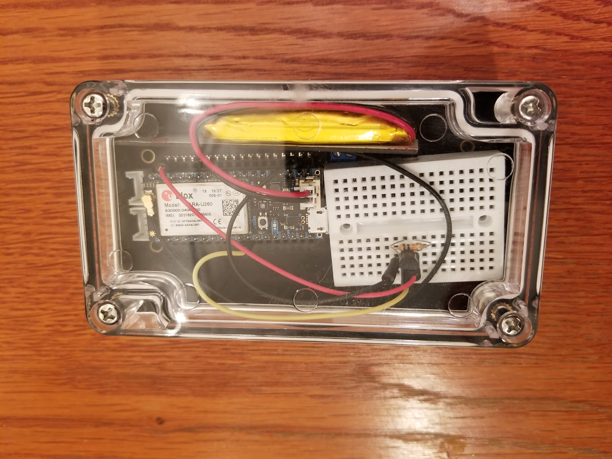
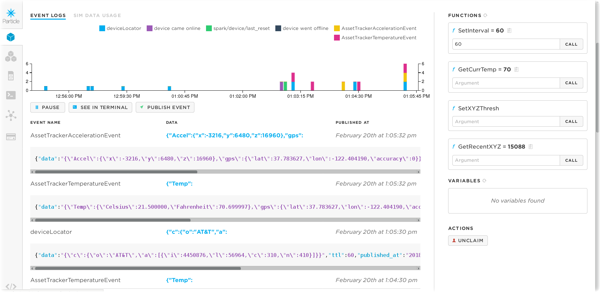

*Read this in other languages: [日本語](README-ja.md).*

# Particle Electron Asset Tracker
The Particle Electron Asset Tracker can be used to collect environmental sensor data, calculate its location using GPS or Cellular triangulation and send both data events to the Particle.io console using Particle Functions.  The power of knowing **Where, What and When** physical things were subjected to harsh environmental conditions can improve many business processes.

In this section we will review :
* Particle Electron Asset Tracker hardware configuration
* Particle software toolchain
* A Watson IoT Asset Tracker program to query and report temperature and accelerometer data to the cloud.

## Particle Electron Asset Tracker v2


The [Particle Electron Asset Tracker v2](https://store.particle.io/products/asset-tracker) board allows you to connect a Particle Electron with its uBlox M8 GNSS GPS receiver and Adafruit LIS3DH Triple Axis Accelerometer. You can connect Grove Sensors to it as well.

## Particle Electron software toolchain
1. Set up your Particle.io Account at  http://login.particle.io/
2. Activate your Particle Electron and give it a name. I called my Electron - blockchain-iot-asset-tracker1
3. Activate the SIM
4. After I registered my Particle Electron, it appeared in the [Particle Devices Console](https://console.particle.io/devices)
5. Particle.io provides a [Particle Build WebIDE](https://docs.particle.io/guide/getting-started/build/core/) or a CLI command line toolchain.
6. I spent some time learning the [WebIDE](https://build.particle.io/) by playing with the samples:
  * Wire a LED to the breadboard using the blink-led program
  * Web Connected LED sample app
  * I modified the Cloud2LED.bin to send LED on/off from Particle cloud down to Electron. I modified it to support case insensitive "on/off" and "ON/OFF" - baby steps!
7. It's worth reading about [Particle Functions](https://docs.particle.io/reference/firmware/core/#particle-function-) so that you can publish and subscribe to events.
8. Since I prefer a command line interface over a Web IDE, I installed the [Particle CLI]( https://docs.particle.io/guide/tools-and-features/cli/electron/) by following the guide.
```
    $ particle login
    $ particle upgrade
```
 The [firmware upgrade](https://docs.particle.io/guide/tools-and-features/firmware-manager/electron/) was important to get the Google Maps geolocation device locator working.  My Particle Electron was factory installed with v0.4.9, once I upgraded to v0.6.4, the Google Maps function finally worked.

9. The next step was to learn about the [$ particle compile]( https://docs.particle.io/reference/cli/#particle-compile) command
```
    $ particle compile
```
In my case:
```
    $ particle compile electron WatsonIoTAssetTracker --saveTo WatsonIoTAssetTracker.bin
```
10. There are lots of Arduino / [Particle libraries](https://docs.particle.io/guide/tools-and-features/libraries/) which you can include in your Particle projects.
```
$ particle library list
$ particle library view AssetTracker
$ particle library view OneWire
```
11. To flash your Particle Electron, you need to install [dfu-util](https://docs.particle.io/faq/particle-tools/installing-dfu-util/core/).
I grabbed a copy of *dfu-util-0.9-1.fc25.x86_64.rpm* from the Fedora 25 repo.
12. Hold down both the Reset and Mode buttons on the Electron
 * Release the Reset button
 * Wait for the LED to turn Yellow
 * Release the Mode button
13. Finally flash your program to the board using the next command
```
$ particle flash --usb firmware.bin
```  
In my case:
 ```
$ particle flash --usb WatsonIoTAssetTracker.bin
 ```
14. To watch what the program is doing, you can set up the USB cable to monitor the [Particle serial](https://docs.particle.io/reference/firmware/photon/#serial) output.  I found that rickkas7 wrote a great [Particle serial tutorial](https://github.com/rickkas7/serial_tutorial)
```
$ particle serial monitor
```

## Watson IoT Asset Tracker program
Let's review the Watson IoT Asset Tracker program implementation found in this repository. It queries and reports temperature and accelerometer data to the cloud along with its location.

Grab the [WatsonIoTAssetTracker.ino](WatsonIoTAssetTracker.ino) code in this repo to follow along in the review. This is a [Particle Simple project](https://docs.particle.io/guide/tools-and-features/libraries/#project-file-structure) so you will also need to download the [project.properties](project.properties) file from the repo. It includes a list of libraries necessary for the program to compile.

### ```void setup()```

The most interesting aspect of this Arduino program is that in ```setup()``` I declare four Particle functions to send and query temperature and accelerometer sensor data.
``` C
// Declare a Particle.function so that we can adjust the Asset Tracking on and off reporting interval from the cloud.
Particle.function("SetInterval",AssetTrackerSetReportInterval);

// Declare a Particle.function so that we can query the current temperature from the cloud.
Particle.function("GetCurrTemp",AssetTrackerGetCurrentTemp);

// Declare a Particle.function so that we can adjust the accelerometer threshold from the cloud.
Particle.function("SetXYZThresh",AssetTrackerSetAccelThresh);

// Declare a Particle.function so that we can query recent accelerometer data from the cloud.
Particle.function("GetRecentXYZ",AssetTrackerGetRecentAccel);
```

The next most interesting thing about the program is that it uses the [Google Maps Locator API](https://docs.particle.io/tutorials/integrations/google-maps/) to triangulate its geo location based on Cellular tower signal strength.  Google knows where the cell towers are (hint - they don't move and are cemented to the ground) and the RSSI strength of the signals from the towers to your thing, its a math calculation to approximate your things' location. Nice that the Particle Electron has a SIM card and communicates over the cellular network. While it's great to use the GPS on the Asset Tracker board, often the thing you want to track is deep in a truck or a car or ship without clear line of sight to the Global Navigation Satellite System - rendering GPS useless. The GPS chipset also draws substantial battery power that would be better used to increase the tracker's time between charges.  In truth, cellular triangulation is not as accurate as GPS. For most cases of answering "where's the thing" as it drives down the highway, a few hundred meter radius is plenty good enough.  I got myself a [Google Maps API Key](https://developers.google.com/maps/documentation/geolocation/get-api-key)  It uses the CellularHelper library.
```
$ particle library view CellularHelper
$ particle library view google-maps-device-locator
```
### Functions
The program proceeds to implement the four Particle Function callbacks and the helper functions to query the accelerometer and temperature sensors.

Of note, while it would have been a much cleaner implementation, I could not get the [Grove Temperature sensor](http://wiki.seeed.cc/Grove-Temperature_Sensor_V1.2/) to work with the Grove connectors on the AssetTracker board. I ordered some good old Dallas DS18B20 temperature sensors.  I wired one of them (and a resistor) to my Particle Electron following these [tutorial instructions](https://docs.particle.io/tutorials/projects/maker-kit/#tutorial-4-temperature-logger). It uses the OneWire library.

### Program Logic
The program wakes up periodically on an interval you set to determine its location.  That triggers a DeviceLocator event.  After querying cellular tower signal strengths and sending the RSSI data to the Google Maps API, it responds back to the board with geolocation latitude / longitude / uncertainty coordinates.  When the program gets the geolocation, it reads the temperature and checks if the accelerometer has exceeded a motion threshold. It then sends three datapoints - **WHERE, WHAT and WHEN** - to the cloud via the Particle callback function *AssetTrackerLocationCallback()*  The combination of that information is the basis of an **IoT Asset Tracker**.

Put it all together and it looks like this.


It also fits nicely into the provided Particle Asset Tracker case:



### Enabling your Cloud Programs to intercept your Particle Function callbacks
You'll be all giddy the first time data arrives in the Particle Console.  Here's a screenshot of temperature data, accelerometer data and geolocation data arriving in the [Particle.io](https://console.particle.io/devices) cloud.


What you really want to do is send that data somewhere else.  In my case, I want to route the IoT data to the IBM Cloud and Node-RED for storage in a Hyperledger Fabric blockchain.  Jump to the next [section](../Node-RED/README.md).  

Before you go, you'll need a Particle token to authorize your Node-RED program to observe / subscribe to these sensor events.
```
$ particle token list
$ particle token new
```
You can see the data in your terminal
```
$ curl https://api.particle.io/v1/devices/events?access_token=<your-token-here>
```
